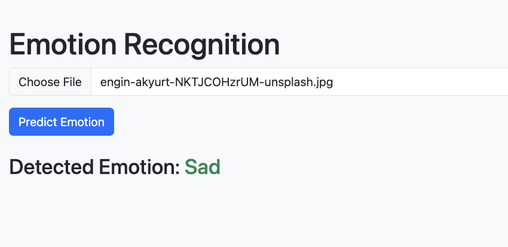

Emotion Sense
=============

This project involves leveraging Artificial Intelligence (AI) technologies to accurately identify and interpret human emotions. By employing advanced AI algorithms and machine learning techniques, the system can effectively detect and understand various emotional states exhibited by individuals.

Dataset
-------

The dataset used for this project is sourced from Kaggle: [Human Face Emotions Dataset](https://www.kaggle.com/datasets/sanidhyak/human-face-emotions). The dataset contains images categorized into three emotions: `Angry`, `Happy`, and `Sad`.

Model Architecture
------------------

The model used in this project is based on the DenseNet architecture, specifically `DenseNet169`, which is a deep learning model pretrained on large datasets like ImageNet. 

Key Features:

-   Transfer learning from `DenseNet169`.
-   Modified the classifier for a 3-class emotion recognition task (`Angry`, `Happy`, `Sad`).
-   Uses `ReLU` activation and `Dropout` for regularization.

Getting Started
---------------

These instructions will guide you on how to set up and run the project, including the model training and prediction.

### Prerequisites

Make sure you have the following prerequisites:

-   Python 3.x installed on your system
-   Internet connection to download required packages

### Installing Dependencies

To install the required packages, follow these steps:

1.  Open a terminal or command prompt.
2.  Navigate to the root directory of the project.
3.  Run the following command to install the necessary Python packages:

    `pip install -r requirements.txt`

Running the Project
-------------------

### 1\. Training the Model

To train the emotion recognition model:

1.  Place your dataset in the appropriate directory (e.g., `data/`), with subfolders for each emotion (Angry, Happy, Sad).
2.  Run the following command to train the model:

    `python train_model.py`

3.  The trained model will be saved at `backend/model/emotion_model.pth`.

### 2\. Running the Flask Backend

Once the model is trained, the backend Flask API can be started to predict emotions from images.

1.  Open a terminal and navigate to the `backend/` directory.
2.  Run the following command to start the Flask server:

    `python app.py`

3.  The backend will be running on `http://localhost:5001`.

### 3\. Running the Frontend

The frontend is built using React, allowing users to upload images and get emotion predictions.

1.  Navigate to the `frontend/` directory.
2.  Install the necessary Node.js packages:

    `npm install`

3.  Start the frontend application:

    `npm run dev`

4.  The frontend will be running on `http://localhost:3000`.

Emotion Recognition System Overview
-----------------------------------

Upon launching the system, you will be presented with a user-friendly interface that allows you to upload an image, and the system will predict the emotion (Angry, Happy, or Sad).

### Key Components

-   **Model**: A DenseNet169-based convolutional neural network (CNN) pretrained on ImageNet and fine-tuned for emotion recognition.
-   **Flask API**: A simple RESTful API that takes an image as input and returns the predicted emotion.
-   **Frontend**: A React-based interface for image uploading and displaying the predicted emotion.

### Result

Future Improvements
-------------------

-   Extend the model to recognize more emotions (e.g., Fear, Surprise, Disgust).
-   Enhance the UI for a better user experience.
-   Add more advanced metrics and insights from the predictions.

Acknowledgments
---------------

This project was built as part of an exploration into AI-driven emotion detection. Thanks to the Kaggle Human Face Emotions Dataset for providing the dataset used in this project.

Authors
-------

-   Devender Singh (idevender) - Frontend and Backend
-   Haoming Luo (JasonLuo2024) - Model
